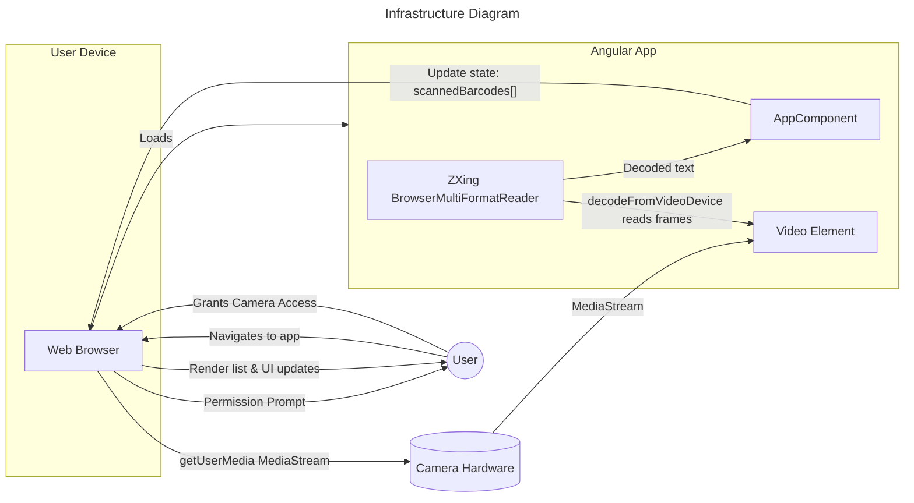
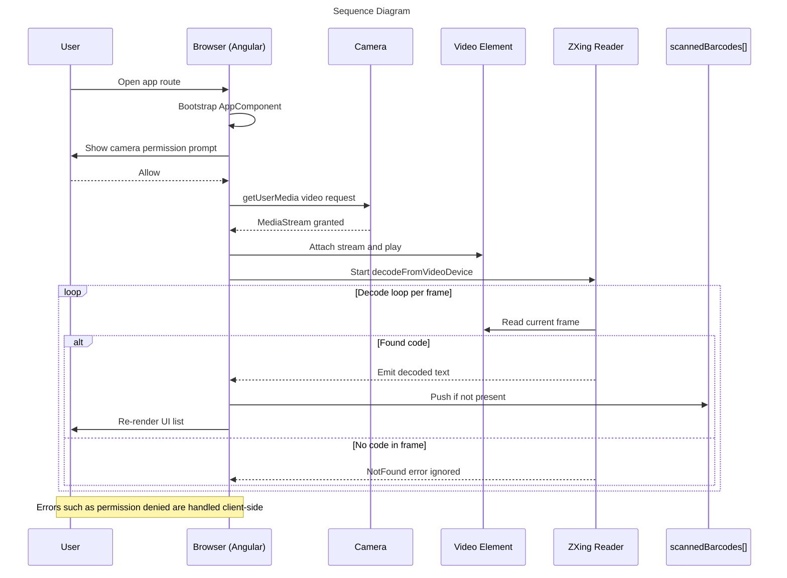
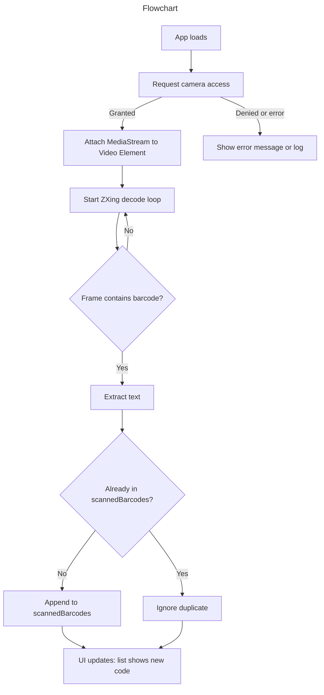

# 📷 Scanular – Barcode Scanner App

Scanular is a lightweight **Angular 17** application that allows users to scan barcodes in real-time using their device’s camera. The app instantly decodes barcodes and displays results with options to copy them easily.  

## 🚀 Features
- 📱 **Real-time Scanning** – Uses your device camera for instant barcode recognition  
- ⚡ **Instant Results** – View decoded information immediately  
- 🔍 **Supports Multiple Formats** – Works with various barcode standards via **@zxing/browser**  
- 📝 **Scanned History** – Displays scanned results in an organized list  
- 📋 **One-Click Copy** – Quickly copy scanned values to clipboard  

## 🛠️ Tech Stack
- **Framework:** Angular 17  
- **UI:** HTML, CSS (custom styled UI with modern components)  
- **Barcode Library:** [@zxing/browser](https://www.npmjs.com/package/@zxing/browser)  
- **Testing:** Jasmine + Karma  
- **Build Tools:** Angular CLI  
- **Code Quality:** SonarQube Integration  

## 📂 Project Structure
```
barcode-scanner-app/
│── src/                 # Source code
│   ├── app/             # Main Angular components
│   ├── assets/          # Images, icons
│   ├── styles.css       # Global styles
│── angular.json         # Angular build/serve configuration
│── package.json         # Dependencies & scripts
│── sonar-project.properties # SonarQube settings
│── karma.conf.cjs       # Test runner configuration
```

## ⚙️ Installation
1. Clone the repository:
   ```bash
   git clone https://github.com/yourusername/barcode-scanner-app.git
   cd barcode-scanner-app
   ```

2. Install dependencies:
   ```bash
   npm install
   ```

3. Run the development server:
   ```bash
   npm start
   ```
   App runs at: **http://localhost:4200/**

4. Build for production:
   ```bash
   npm run build
   ```

5. Run tests:
   ```bash
   npm test
   ```

## 🧪 SonarQube Integration
This project includes **SonarQube** configuration for static analysis and code coverage.  
- Configure your **SonarQube server** in `sonar-project.properties`  
- Run analysis with:
  ```bash
  sonar-scanner
  ```

## Infrastructure Diagram


## Sequence Diagram


## Flowchart


## 📷 Usage
1. Launch the app in your browser.  
2. Click **Start Scanning**.  
3. Position a barcode inside the scanner frame.  
4. View results instantly.  
5. Copy results with one click.  

## 📌 Roadmap
- [ ] Add support for QR codes  
- [ ] Enable export of scanned history  
- [ ] Dark mode UI  

## 📄 License
This project is licensed under the **MIT License**.  
